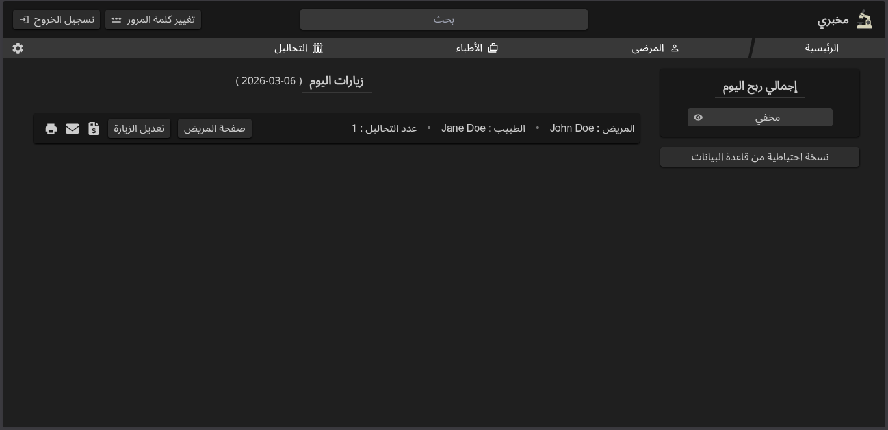
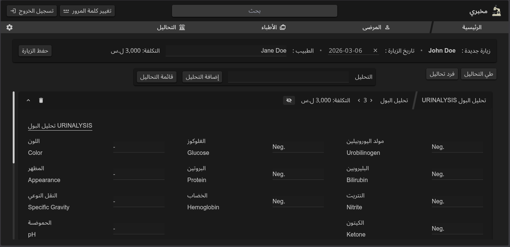

# My Lab

Laboratory management system for patient record-keeping and automated report/invoice generation.

## Overview

Laboratory management system built for a medical facility to streamline patient report generation and data management. Processes 450+ patient reports monthly, reducing report generation time from 10 minutes to under 2 minutes per patient (80% time reduction).

Features standardized templates for common medical tests with customizable printing options and automated invoice generation.

## Tech Stack

- **Frontend:** Next.js, React, JavaScript, Tailwind CSS
- **Backend:** Node.js, Prisma ORM
- **Database:** SQLite
- **Deployment:** Custom deployment scripts with Git-based updates

## Key Features

- **Automated report generation** with customizable templates for common lab tests
- **Invoice and envelope generation** with standardized formatting
- **Git-based deployment system** with custom scripts enabling non-technical users to pull updates, run migrations, and rebuild the application independently
- **Real-time data validation** for patient records and test results
- **Search and filtering** for quick patient lookup
- **Print-optimized layouts** for professional report output

## Screenshots

**Landing Page**

**New Visit Page**

## Status

In active production use since November 2024. Currently processing 450+ patient reports monthly.

## Deployment

This application runs on local infrastructure. A custom deployment pipeline was built using shell scripts that:

1. Fetch latest changes from GitHub
2. Install dependencies
3. Run database migrations
4. Build the Next.js application

This allows non-technical staff to update the system independently without developer intervention.

## License

MIT License
